# Equity Derivatives Pricing and Hedging Simulator

## Introduction

This project starts from the Black-Scholes model to build, step by step, a pricing and hedging simulator for equity options: pricing a European call/put, the Greeks (delta, gamma, vega, theta, rho), implied volatility, simulating the underlying, and delta hedging with analysis of the resulting P&L.

The goal isn't to reproduce a professional desk's tooling, but to understand in depth — and be able to concretely show — how these theoretical building blocks fit together: why an option seller who is delta-hedged can still lose money, how rebalancing frequency affects risk, and what changes when testing all this on real market data instead of simulated paths.

## Theory

### Black-Scholes

The model assumes the underlying follows a geometric Brownian motion (log-normal returns, constant volatility σ and risk-free rate r, no transaction costs, European exercise only). Under these assumptions, the price of a call and a put with continuous dividend q are given by:

```
C = S·e^(−qT)·N(d1) − K·e^(−rT)·N(d2)
P = K·e^(−rT)·N(−d2) − S·e^(−qT)·N(−d1)

d1 = [ln(S/K) + (r − q + σ²/2)·T] / (σ√T)
d2 = d1 − σ√T
```

These two prices aren't independent: **call-put parity** (`C − P = S·e^(−qT) − K·e^(−rT)`) must always hold, and serves as a basic consistency check in `tests/test_pricing.py`.

### Greeks

Each Greek measures the price's sensitivity to a variable: delta (spot), gamma (change in delta, i.e. convexity in spot), vega (volatility), theta (time), rho (rate). `src/greeks.py` implements them by differentiating the formulas above directly. The [Vega vs gamma](#vega-vs-gamma-whats-the-difference) section below details the difference between the two second-order sensitivities.

### Implied volatility and hedging

Implied volatility is the inverse operation: instead of starting from σ to compute a price, you start from an observed price and recover the σ that justifies it (numerical inversion of Black-Scholes, see `src/implied_volatility.py`). Delta hedging, meanwhile, uses delta as a hedge ratio: holding `Δ` shares per option sold (locally) neutralizes spot exposure. Since Δ changes with spot (because of gamma), the hedge has to be rebalanced — hence the residual P&L studied in the Results section.

## Results

Each image below is generated by a function in `src/plots.py`. To regenerate them, open `plots.py` in VS Code and use *Run Current File in Interactive Window*.

### Black-Scholes price vs spot

`plot_price_vs_spot()`

European call and put, K=100, T=1, r=5%, q=0%, for three volatility levels (10%, 20%, 40%), with intrinsic value shown as a reference.

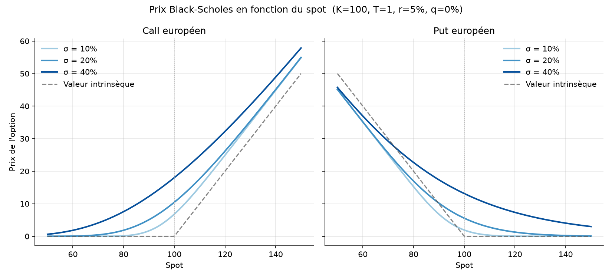

### Delta vs spot

`plot_delta_vs_spot()`

Call and put delta, K=100, T=1, r=5%, σ=20%, q=0%. The call trends toward 1 as spot rises, the put trends toward −1 as spot falls — the slope is steepest near the strike (K=100).

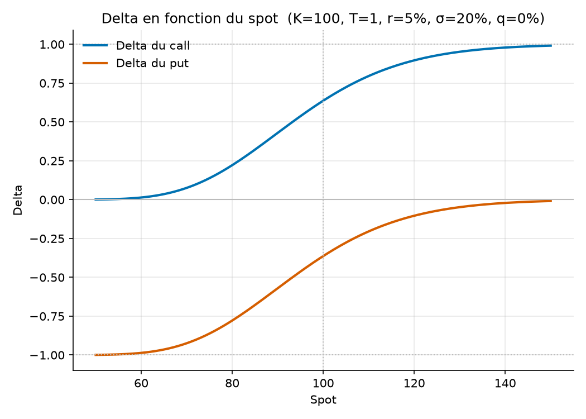

### Gamma vs spot

`plot_gamma_vs_spot()`

Gamma (identical for call/put), K=100, r=5%, σ=20%, q=0%, for three maturities (0.25, 1, 2 years). The closer to expiry, the higher and narrower the gamma peak around the strike — which is what makes a short-dated option hard to hedge close to expiry.

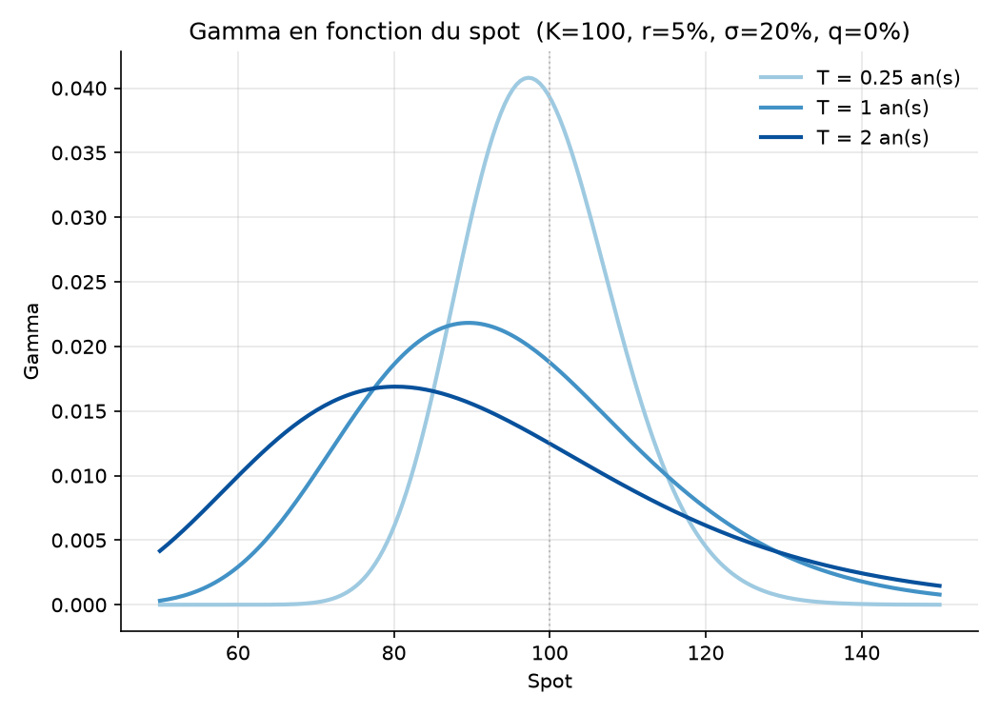

### Vega vs spot

`plot_vega_vs_spot()`

Vega (identical for call/put), K=100, r=5%, σ=20%, q=0%, for three maturities (0.25, 1, 2 years). Unlike gamma, vega increases with maturity — the more time remaining, the more a change in volatility impacts the price.

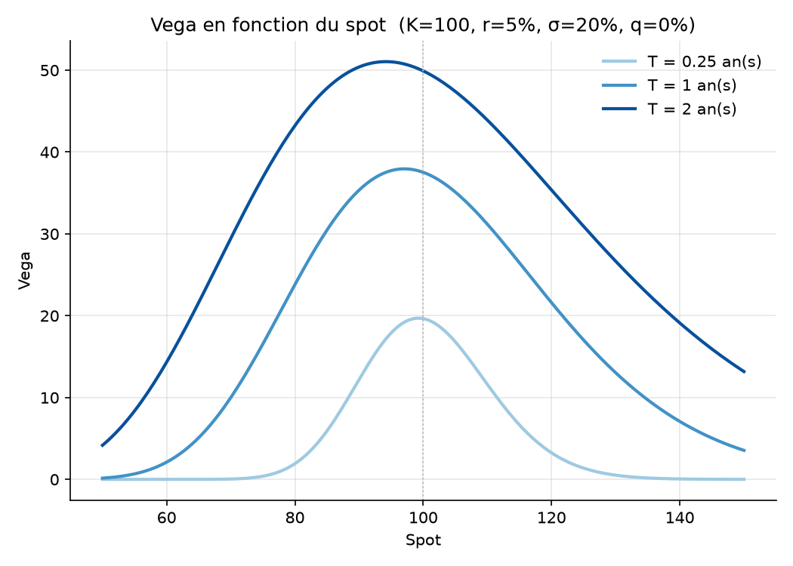

#### Vega vs gamma: what's the difference?

Both measure a second-order sensitivity, but not with respect to the same variable:

- **Gamma** = sensitivity of delta to **spot**. Answers: *"if the underlying moves $1 right now, how much does my delta (hedge ratio) change?"* It materializes through actual moves in the underlying — that's why it's tied to delta hedging (it dictates the rebalancing speed).
- **Vega** = sensitivity of price to **volatility**. Answers: *"if the market changes its mind about future volatility, how much does the price change, even if spot doesn't move?"* It materializes even without any move in the underlying — just because the market reprices future risk (e.g. an earnings announcement is coming up, implied vol rises, the option gains value even though spot hasn't moved).

The two charts above illustrate this as mirror images: gamma is high when maturity is **short** (the price has to "make up its mind" fast), vega is high when maturity is **long** (more time = more potential uncertainty over the path of vol). A short-dated option is more of a "gamma" play, a long-dated one more of a "vega" play.

### Theta vs spot

`plot_theta_vs_spot()`

Call and put theta, K=100, T=1, r=5%, σ=20%, q=0%. The call always stays negative. The put, however, spontaneously turns **positive** once it's deep enough ITM (spot ≲ 88) — without forcing any extreme parameter: collecting the strike early (via the `+r·K·e^(−rT)·N(−d2)` term) then outweighs the lost optionality.

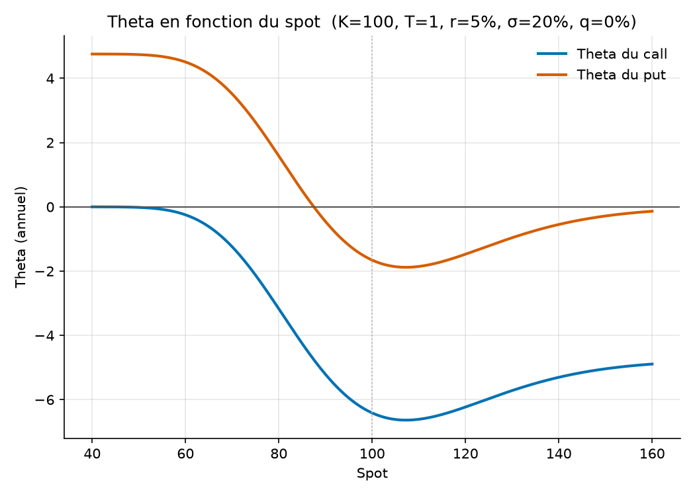

### Special case: theta of a deep-ITM call as a function of the dividend

`plot_theta_dividend_effect()`

Unlike the put, the call never turns positive-theta without a dividend (the q=0% curve stays negative throughout). With a high dividend (q=10%, 20%), the theta of a deep-ITM call turns positive in turn — the `+q·S·e^(−qT)·N(d1)` term eventually dominates.

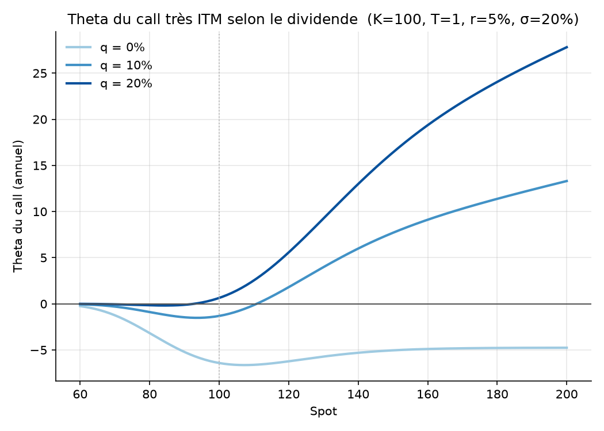

### Rho vs spot

`plot_rho_vs_spot()`

Call and put rho, K=100, T=1, r=5%, σ=20%, q=0%. Call rho is always positive (a higher rate increases the call's value), put rho is always negative — both tend toward 0 at the extremes (deep OTM/ITM options).

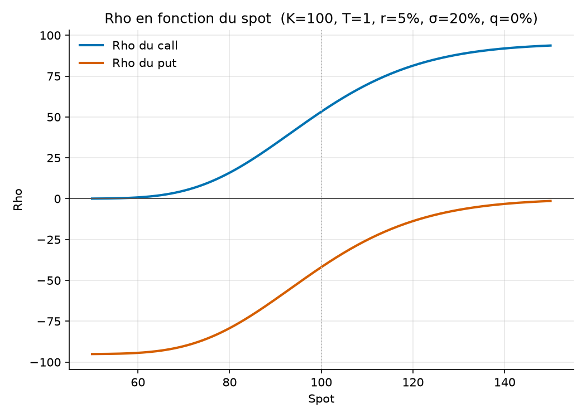

### Implied volatility smile (synthetic)

`plot_implied_vol_smile()`

**Note: synthetic "market" vol, not real data.** Call prices are built from a made-up vol curve (higher for low strikes plus a bit of convexity, similar to the skew observed on equity indices), then that curve is recovered strike by strike with `implied_volatility_call` (`brentq`). The two curves overlap exactly — which validates that the inversion works across a whole range of strikes, not just at the single point tested in `implied_volatility.py`.

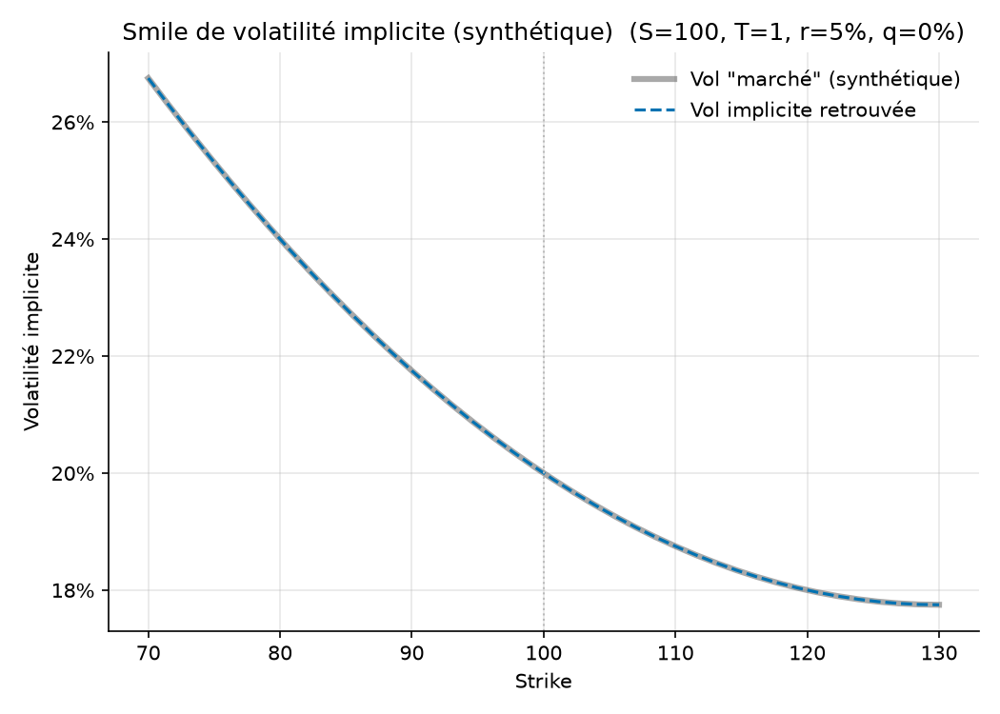

### Delta hedging simulation

`plot_hedge_simulation()`

A simulated path (K=100, T=1, r=5%, σ=20%, rebalanced at every step), seen from the perspective of a delta-hedged call seller. Three panels synced in time: spot, the rebalanced delta (which tracks spot closely and falls to 0 when the option ends up deep OTM), and mark-to-market P&L (hedge portfolio value minus the theoretical value of the option still owed). P&L moves in small jumps at each rebalance — that's the friction of discrete hedging (rebalancing continuously would be the theoretical ideal, impossible in practice).

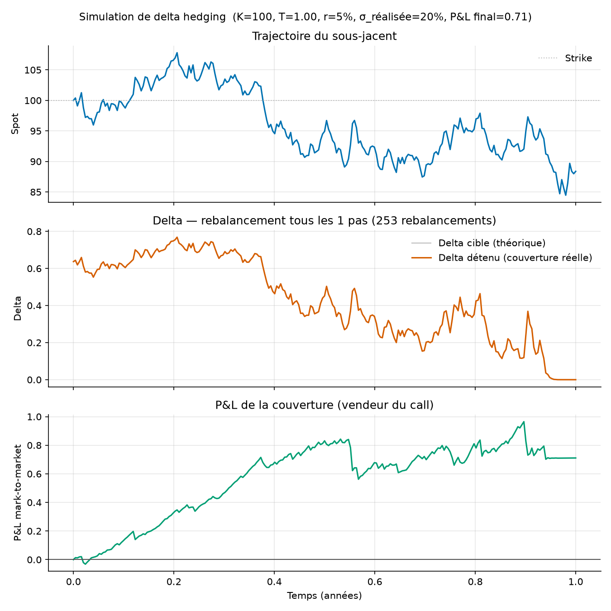

### Daily vs weekly rebalancing

`plot_hedge_simulation(rebalance_every=5)`

Same path, but rebalanced only every 5 steps (~weekly) instead of every day. The held delta (orange) tracks the target delta (grey) in a stair-step fashion, with a real gap between rebalances — especially visible around t=0.55 and t=0.9, where P&L makes sharper net jumps.

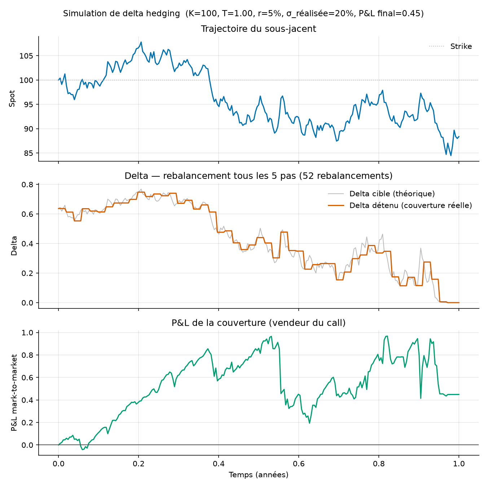

**Statistical comparison** (2000 paths, K=100, T=1, r=5%, realized vol = implied vol = 20%):

| Frequency | Mean P&L | P&L std dev | Avg. rebalances |
|---|---|---|---|
| Daily (every step) | −0.006 | 0.436 | 253 |
| Weekly (every 5 steps) | −0.019 | 0.953 | 52 |

Mean P&L stays close to zero in both cases (the hedge isn't biased), but the **standard deviation nearly doubles** for weekly rebalancing at 5x fewer rebalances. This is the real trade-off of discrete delta hedging: rebalancing less often reduces transaction costs but sharply increases risk (P&L dispersion) — rebalancing continuously would be the theoretical ideal (zero risk), impossible in practice.

### Threshold-based (adaptive) rebalancing

`plot_hedge_simulation(rebalance_threshold=0.05)`

A third mode: instead of a fixed interval, rebalancing happens as soon as the theoretical delta drifts away from the held delta by more than a given threshold (5% here). The held delta tracks the target delta much more closely than in the weekly case — the threshold rebalances more when the market really moves, and less when it's calm.

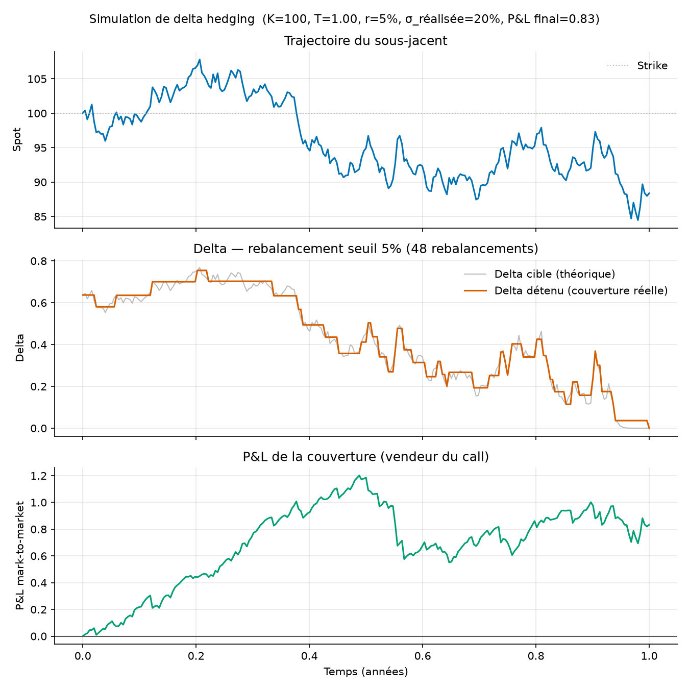

**Full comparison** (2000 paths, same parameters):

| Strategy | Mean P&L | P&L std dev | Avg. rebalances |
|---|---|---|---|
| Daily | −0.013 | 0.431 | 253 |
| Weekly | −0.025 | 0.959 | 52 |
| 5% threshold | 0.006 | 0.678 | 38.7 |
| 10% threshold | 0.029 | 1.058 | 15.6 |

Notable result: at a comparable number of rebalances, the **threshold beats the fixed schedule**. The 5% threshold (38.7 rebalances, slightly fewer than weekly) achieves a standard deviation of 0.678, well below weekly's 0.959 (52 rebalances). Rebalancing *when the market moves* rather than *on a schedule* reduces risk for an equivalent transaction budget — which is what most desks do in practice.

### Real price and realized volatility: S&P 500

`plot_real_price_and_volatility()`

**Note: real data used for illustrative and educational purposes, not to the rigor of a professional desk** (no advanced handling of holidays/splits/dividends beyond what `yfinance` provides, no data cleaning). S&P 500 (`^GSPC`) adjusted close prices over 2 years via `yfinance`, and rolling realized volatility over a 21-day window (~1 month), annualized. The dashed grey line is the average realized vol over the whole period (16%). It's very clear that **volatility is not constant in reality** — contrary to the Black-Scholes assumption — with a spike to ~49% coinciding exactly with the sharp price drop visible in the top panel.

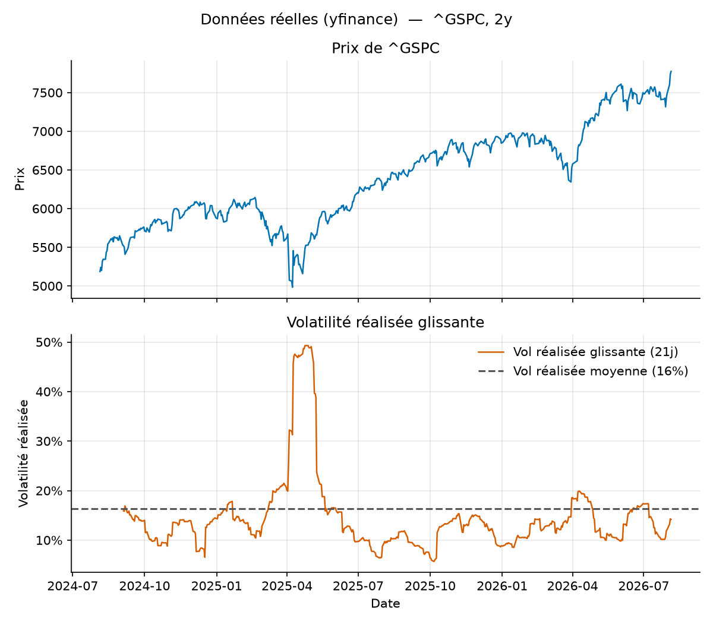

### Real price and realized volatility: Apple

`plot_real_price_and_volatility(ticker="AAPL", save_path="../plots/real_price_and_vol_aapl.png")`

Same reading, for Apple (`AAPL`). Same volatility spike (broad market, same period), but noticeably sharper (up to 78%) and a higher average (29% vs 16% for the index) — an individual stock is always more volatile than a diversified index.

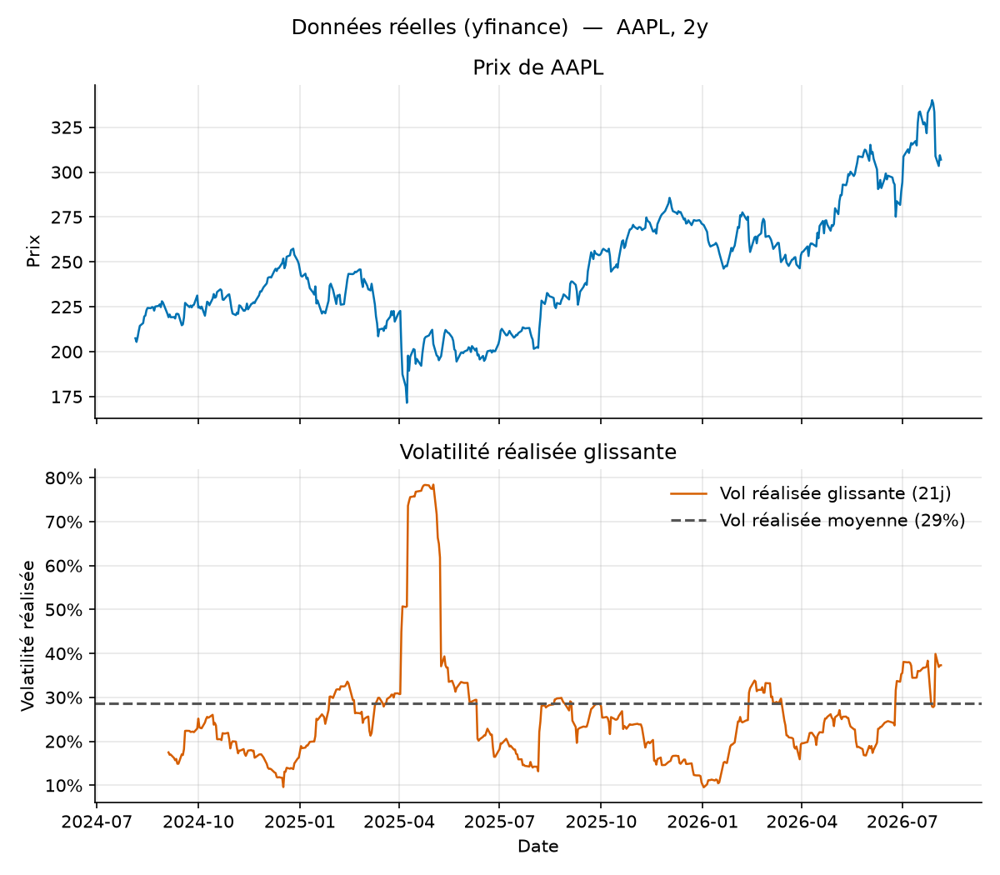

### Delta hedging on a real path: Apple

`plot_real_hedge_simulation()`

**Note: this project has no real source of market implied volatility** — the only implied vol here is the synthetic one from `plot_implied_vol_smile()` (no real options data). The "implied vol" used here to price the option and compute the theoretical delta is therefore simply the historical realized vol measured on the same path, not a real market vol observed from actual option prices. This simulation reuses exactly the same engine (`delta_hedge_call`) as the simulated paths above, but with `price_path` pointing to a real price series fetched via `market_data.py` instead of a geometric Brownian path — it's meant to show what delta hedging looks like on a real market path (irregular, with its own volatility regimes), not to measure real historical trading P&L.

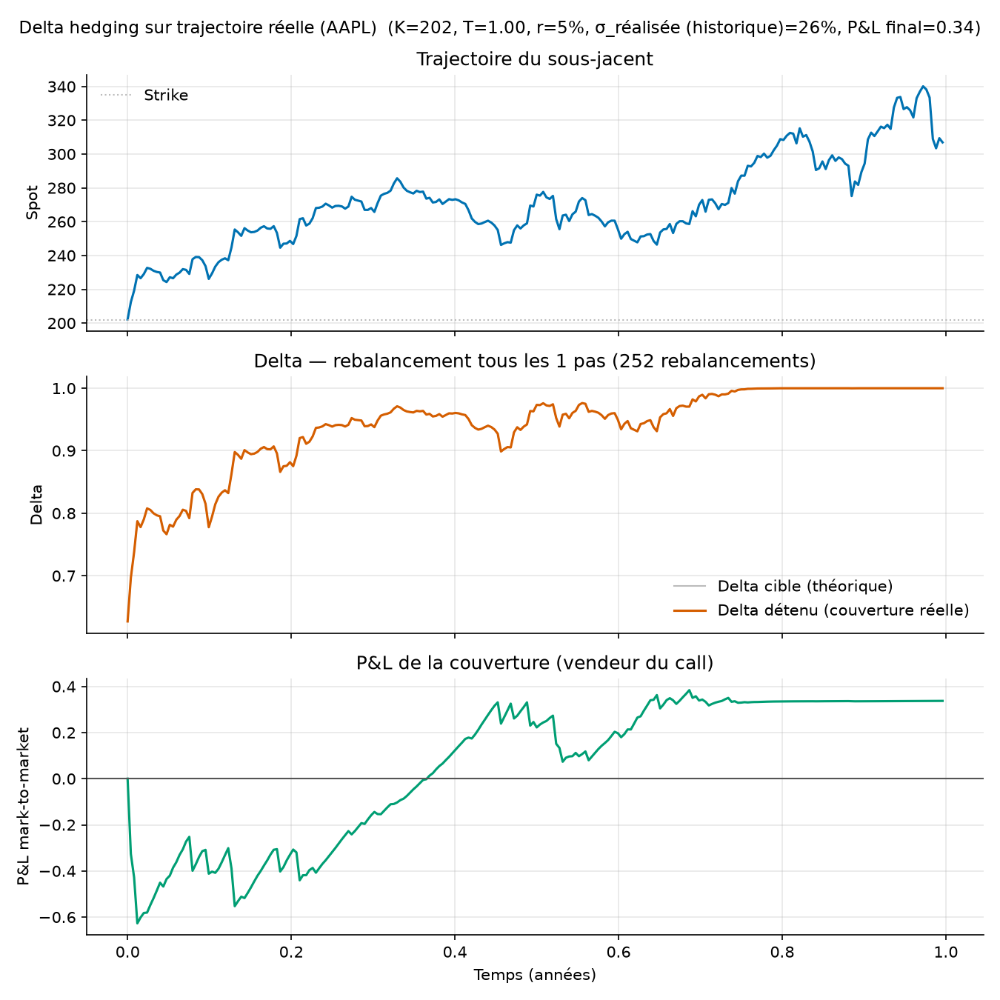

### Realized dispersion: AAPL / MSFT / NVDA / AMZN / META basket

`plot_dispersion_analysis()`

**Note: "realized" dispersion, not an actual desk dispersion trade.** A real dispersion trade sells index *implied* vol and buys the constituents' *implied* vol — this project has no real options data (see the caveat on `plot_implied_vol_smile()` above). What follows only uses *realized* vol and correlation on real prices, to illustrate the underlying mechanism: why an index's vol is almost always lower than the average of its constituents, and the exact role correlation plays in that gap.

Five real stocks (`AAPL`, `MSFT`, `NVDA`, `AMZN`, `META`), equally weighted, prices over 2 years via `yfinance`. The "mini-index" is built by indexing each stock to 100 at the start and then summing the weighted levels — so that each stock's dollar price doesn't distort its weight.

**Round-trip check**: the basket's vol can be computed two independent ways.
- *Direct*: compute the returns of the basket itself, just like for any stock → **26.2%**.
- *Via the formula*: start only from the individual vols and the correlation matrix, and reconstruct `σ_basket² = wᵀ Σ w` (with `Σᵢⱼ = σᵢ σⱼ ρᵢⱼ`) → **25.8%**.

The two methods agree to within ~0.4 points (a small expected gap: the formula is exact for simple returns, but is applied here to log returns, whose weighted sum isn't rigorously equal to the basket's log return). This round-trip validates the correlation computation, exactly like the price → implied vol → price round-trip validated the Black-Scholes inversion.

Once the formula is validated, it isolates the correlation effect: the weighted average of the individual vols is **34.9%**, well above the basket's ~26%. The gap (~9 points) is entirely due to diversification — pairwise correlations (0.31 to 0.58 on the heatmap) are well below 1, so the stocks' moves partly cancel out instead of adding up. This is precisely the gap a dispersion trade tries to monetize: if the market prices in a higher implied correlation than the correlation that actually materializes, selling index vol and buying the constituents' vol is profitable (and vice versa).

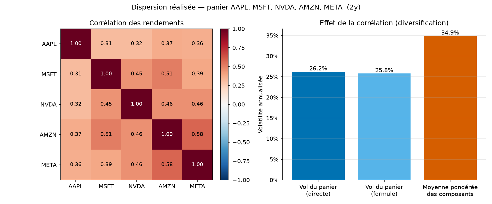

## Features

| Module | Contents |
|---|---|
| `src/black_scholes.py` | European call/put pricing, call-put parity |
| `src/greeks.py` | Delta, gamma, vega, theta, rho (call and put) |
| `src/implied_volatility.py` | Numerical inversion of Black-Scholes (`brentq`) to recover σ from a price |
| `src/simulation.py` | Path simulation via geometric Brownian motion |
| `src/hedging.py` | Delta hedging (fixed-interval or threshold rebalancing), mark-to-market P&L |
| `src/market_data.py` | Fetching real prices (`yfinance`), log returns, realized volatility (overall and rolling) |
| `src/dispersion.py` | Realized vol + correlation of a stock basket, building a weighted basket, bottom-up check of its vol |
| `src/plots.py` | All the project's visualizations, one function per chart, each function saves its PNG to `plots/` |
| `app.py` | Interactive Streamlit interface on top of the modules above (see dedicated section below) |

## Limitations

This project is an educational tool, not a desk tool. Main limitations to keep in mind when reading the results above:

- **No real implied volatility data.** No source of real option prices is used: the smile in the Results section is entirely synthetic, and the "implied vol" used in delta hedging on real data is actually historical realized vol. A real dispersion trade is played on *implied* vols and correlation, not realized ones — this project can only illustrate the underlying mechanics (see the Dispersion section).
- **Black-Scholes itself is a simplification**: constant volatility and rate, no price jumps, European exercise only (no American options), no transaction costs or liquidity constraints in delta hedging.
- **Real data not cleaned to a professional level**: uses what `yfinance` provides as-is (holidays, splits, dividends handled by `auto_adjust=True`), with no additional processing.
- **The "mini-index" in the Dispersion section is a simplified construction** (an equally-weighted basket of 5 stocks indexed to 100), not a real index with float-market-cap weighting and a rebalancing methodology.

## Tests

`tests/test_pricing.py` and `tests/test_greeks.py` validate, across several parameter sets (`tests/params.py`): call-put parity, price positivity, monotonicity in spot and volatility, delta bounds ([0,1] for the call, [−1,0] for the put), and the sign of gamma/vega/rho. To run them:

```
.venv/bin/python -m pytest tests/
```

## Interactive interface (Streamlit)

**Live app: [equity-derivatives-simulator-wgrj8rugktksm3x3qh4jpz.streamlit.app](https://equity-derivatives-simulator-wgrj8rugktksm3x3qh4jpz.streamlit.app)** (free Streamlit Community Cloud hosting — the app may take a few seconds to wake up after a period of inactivity).

`app.py`, at the project root, exposes 4 tabs to explore parameters live without touching the code: **Pricing & Greeks** (S/K/T/r/σ/q sliders, price and Greeks recomputed in real time + comparison chart across 3 vol levels), **Implied vol smile** (adjustable synthetic curve parameters), **Delta hedging** (choice of rebalancing mode — fixed interval or threshold —, P&L and a 3-panel chart), **Dispersion** (basket ticker selection, correlation and vols recomputed via `yfinance`).

To run it locally:

```
.venv/bin/streamlit run app.py
```

The app reuses the functions from `src/` directly (no duplicated logic) — the plotting functions in `src/plots.py` accept `save_path=None` to avoid writing anything to disk in interactive mode, and return the matplotlib figure instead of just displaying/saving it.
